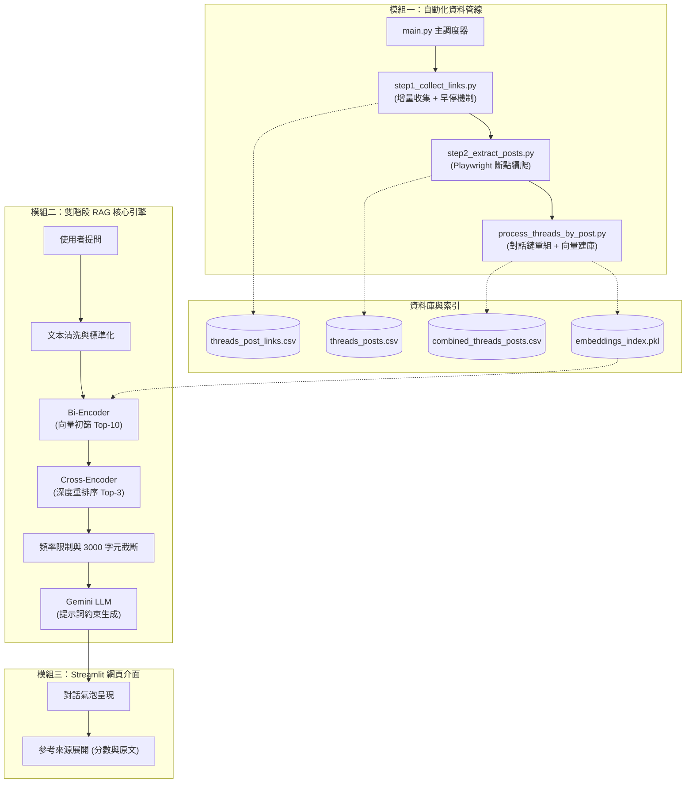

# 專案成果報告：Threads 財經與職涯問答助理 v2.0

> **文件目的**：說明本專案之背景問題、系統架構、各模組實作細節、量化數據與技術演進  
> **線上展示**：https://nlpfinalproject-nnrg9joqc32rdajxyyeks3.streamlit.app/

---

## 一、專案背景與動機

### 1.1 背景說明
本專案的知識來源為 Threads 帳號 [@make_investment_easy](https://www.threads.net/@make_investment_easy) 所發布的內容。該作者具備國際投資銀行交易員背景，長期分享涵蓋以下領域的專業觀點：

- **投資策略與風險管理**：日圓套利交易、資產負債表結構、大宗商品供需與裂解價差。
- **總體經濟與市場分析**：央行利率政策、美債殖利率曲線、地緣政治對半導體與科技股 EPS 的影響。
- **金融業職涯與晉升思維**：投行分析師工作內容、薪酬結構、商業人脈建立。
- **個人理財與生活決策**：本金累積邏輯、資產配置、跨國生活成本比較（台灣、新加坡、澳洲）。

### 1.2 核心問題與挑戰

| 面臨問題 | 具體情況說明 |
|---|---|
| **資訊分散** | 數百篇貼文缺乏分類與全文檢索機制，難以快速尋找特定主題。 |
| **串文切碎** | 平台限制使長篇分析被拆分為多則串文，單篇閱讀容易失去前後文脈絡。 |
| **模型幻覺** | 直接使用通用 LLM 詢問時，容易產生看似合理但非作者原意的內容。 |
| **資料維護成本** | 作者持續發布新貼文，若無自動化增量機制，維護更新耗時費力。 |

---

## 二、系統架構與模組設計

本專案由「自動化資料管線」、「雙階段 RAG 核心引擎」與「Streamlit 網頁介面」三大模組組成：

---

## 三、模組一：自動化資料更新管線

**相關程式**：`main.py`、`step1_collect_links.py`、`step2_extract_posts.py`、`process_threads_by_post.py`

此模組負責自 Threads 網頁採集貼文資料，將切碎的串文重組為連貫長文，並建立向量索引。

### 步驟 1：增量連結收集 (`step1_collect_links.py`)
- **技術**：`playwright`、`pandas`
- **運作機制**：
  - 載入 `cookies.json` 模擬登入以取得完整滾動權限。
  - 滾動頁面時比對 `threads_post_links.csv`，若連續遇到 4 篇已知貼文則觸發早停 (Early-Stopping)，停止滾動。
  - 輸出最新貼文網址清單至 `threads_post_links.csv`。

### 步驟 2：內文提取與斷點續爬 (`step2_extract_posts.py`)
- **技術**：`playwright`、`beautifulsoup4`、`pandas`、`json`
- **運作機制**：
  - 逐一存取未處理的貼文頁面，解析主貼文與原作者的所有後續串文（排除其他用戶回覆）。
  - 過濾按讚、轉發、時間戳記等非正文 UI 噪訊。
  - 使用 `processed_urls.json` 記錄已處理 URL，支援中斷後接續執行；每提取一篇即時追加至 `threads_posts.csv`。

### 步驟 3：對話鏈重組與向量建庫 (`process_threads_by_post.py`)
- **技術**：`pandas`、`re`、`sentence_transformers`、`pickle`
- **運作機制**：
  - 利用正規表達式解析「貼文編號」與「串文順序」，將同主題的所有串文按順序以換行符拼接為長篇論述，輸出 `combined_threads_posts.csv`。
  - 執行文本清洗後，使用 `paraphrase-multilingual-MiniLM-L12-v2` 計算 384 維語意向量。
  - 將向量索引序列化儲存為 `embeddings_index.pkl`（排除模型權重以縮減體積），並產出統計中繼資料 `pipeline_metadata.json`。

### 管線主程式 (`main.py`)
- 提供單一執行入口，依序非同步調度步驟 1 ➡️ 步驟 2 ➡️ 步驟 3，並於完成後輸出各階段耗時與筆數統計摘要 (`pipeline_summary.txt`)。

---

## 四、模組二：雙階段 RAG 檢索引擎

**相關程式**：`rag_engine.py`

### 4.1 兩階段檢索機制
單一階段向量檢索對長文本容易受局部詞彙干擾，且單次傳送過多候選段落給 LLM 會增加費用與延遲。本系統採用兩階段檢索：

| 檢索階段 | 使用模型 | 運作方式 | 輸出結果 |
|---|---|---|---|
| **第一階段：語意召回 (粗篩)** | `paraphrase-multilingual-MiniLM-L12-v2` (Bi-Encoder) | 快速計算問題向量與貼文向量之餘弦相似度 | 召回 **Top-10** 候選貼文 |
| **第二階段：深度重排序 (精篩)** | `cross-encoder/ms-marco-MiniLM-L-6-v2` (Cross-Encoder) | 將問題與 10 篇候選貼文進行交叉注意力比對評分 | 選取 **Top-3** 核心貼文 |

### 4.2 防護機制與生成控制
1. **上下文長度控制**：動態限制送入 LLM 的文本總長度在 3000 字元以內，維持回應延遲於 5–8 秒。
2. **API 頻率限制 (`RateLimiter`)**：設定 RPM ≤ 10 與 RPD ≤ 200，遇頻率尖峰自動排程等待。
3. **提示詞約束**：
   - 角色設定：以原作者視角與專業風格回答。
   - 誠實原則：若檢索段落無相關資訊，須明確回答未找到，不得編造。
   - 輸出要求：繁體中文、條列式說明。

---

## 五、模組三：Streamlit 網頁介面

**相關程式**：`app.py`

### 功能特點
- **互動式聊天介面**：維護對話歷程，支援 Markdown 排版渲染。
- **快取載入**：使用 `@st.cache_resource` 快取向量索引與 Cross-Encoder 模型，減少重複載入開銷。
- **參考來源折疊面板**：每則回覆下方附帶折疊選單，展示引用貼文編號、文字內容與重排序相關性評分。
- **超參數調整**：側邊欄提供滑桿，支援即時微調 Temperature 與 Top-K Rerank 數量。
- **架構與狀態展示**：提供知識庫篇數、更新時間與系統流程圖檢視面板。

---

## 六、量化成果與技術數據

| 項目指標 | 數值 | 說明 |
|---|---|---|
| **知識庫主題貼文數** | **711 ~ 738 篇** | 經由去重與對話鏈重組後的長篇論述 |
| **原始串文節點數** | **1,693+ 條** | 採集到的單篇貼文與串文總數 |
| **向量索引檔大小** | **1.8 ~ 3.9 MB** | 排除 PyTorch 模型本體權重後的純向量與中繼資料 |
| **平均回應延遲** | **5–8 秒** | 包含兩階段檢索與 LLM 生成的時間 |
| **上下文精簡幅度** | **約 70%** | 經 Cross-Encoder 精篩由 Top-10 縮減至 Top-3 |
| **API 呼叫保護** | **RPM ≤ 10 / RPD ≤ 200** | 避免超出 API 配額 |

---

## 七、檔案結構與職責清單

| 檔案名稱 | 類型 | 職責說明 |
|---|---|---|
| `app.py` | Python | Streamlit 前端介面主程式 |
| `rag_engine.py` | Python | RAG 運算核心（清洗、向量檢索、重排序、限速、Gemini 生成） |
| `main.py` | Python | 資料管線調度主程式 |
| `step1_collect_links.py` | Python | 步驟 1：增量收集貼文連結（支援早停機制） |
| `step2_extract_posts.py` | Python | 步驟 2：貼文與串文提取（支援斷點續爬） |
| `process_threads_by_post.py` | Python | 步驟 3：對話鏈重組、清洗與向量建庫 |
| `combined_threads_posts.csv` | 資料檔 | 對話鏈重組後供檢索的知識庫主資料 |
| `threads_posts.csv` | 資料檔 | 採集的原始單篇貼文與串文集合 |
| `threads_post_links.csv` | 資料檔 | 目標貼文網址清單 |
| `processed_urls.json` | 資料檔 | 斷點續爬狀態記錄檔 |
| `embeddings_index.pkl` | 資料檔 | 序列化的語意向量索引檔 |
| `pipeline_metadata.json` | 資料檔 | 知識庫更新時間與數量統計中繼資料 |
| `cookies.json` | 憑證檔 | Threads 模擬登入憑證 |
| `requirements.txt` | 設定檔 | 環境相依套件清單 |
| `PRD.md` | 文件 | 產品需求規格書 |
| `PROJECT_REPORT.md` | 文件 | 專案技術成果報告 |
| `presentation_outline.md` | 文件 | 簡報大綱與投影片規劃 |

---

## 八、版本演進對照 (v1.0 vs v2.0)

| 評估維度 | v1.0（實驗版本） | v2.0（正式版本） |
|---|---|---|
| **操作介面** | Jupyter Notebook 程式碼執行 | Streamlit 互動式 Web 介面 |
| **資料管線** | 手動分批執行與人工整併 | `main.py` 一鍵自動化增量更新與斷點續爬 |
| **檢索機制** | 單階段 Bi-Encoder 向量檢索 | 雙階段（Bi-Encoder 召回 + Cross-Encoder 重排序） |
| **防護機制** | 無限制 | RPM/RPD 頻率限制、3000 字元長度截斷、提示詞約束 |
| **索引檔案體積** | 450+ MB (包含模型權重) | 1.8~3.9 MB (排除模型權重，載入速度顯著提升) |

---

## 九、常見問題 (FAQ)

**Q1：如何確認回答內容並非 AI 虛構？**  
A：系統採取三項措施：(1) 透過 Cross-Encoder 挑選最相關原文；(2) 提示詞限制僅能依據參考段落回覆，否則如實拒答；(3) 介面提供折疊面板，可直接查看引用的貼文編號、內容與相關性評分。

**Q2：目標作者發布新貼文時，如何更新資料庫？**  
A：執行 `python main.py` 即可。系統會啟動增量檢查，若連續遇到 4 篇已知舊貼文即停止滾動，僅抓取新貼文並追加至資料庫，隨後自動更新向量索引。

**Q3：本架構是否可遷移至其他領域或資料集？**  
A：可以。此系統採模組化設計，只需替換目標帳號或置換知識庫 CSV 檔案，即可套用於其他專利、企業規章或特定專家知識庫。

---

## 十、專案總結

本專案建立了從非結構化社群資料採集、長串文對話鏈重組、語意向量建庫到雙階段 RAG 檢索問答的完整流程。透過增量早停、斷點續存與重排序架構，在維持資料新鮮度的同時，確保了問答的準確性與系統的穩定性。
