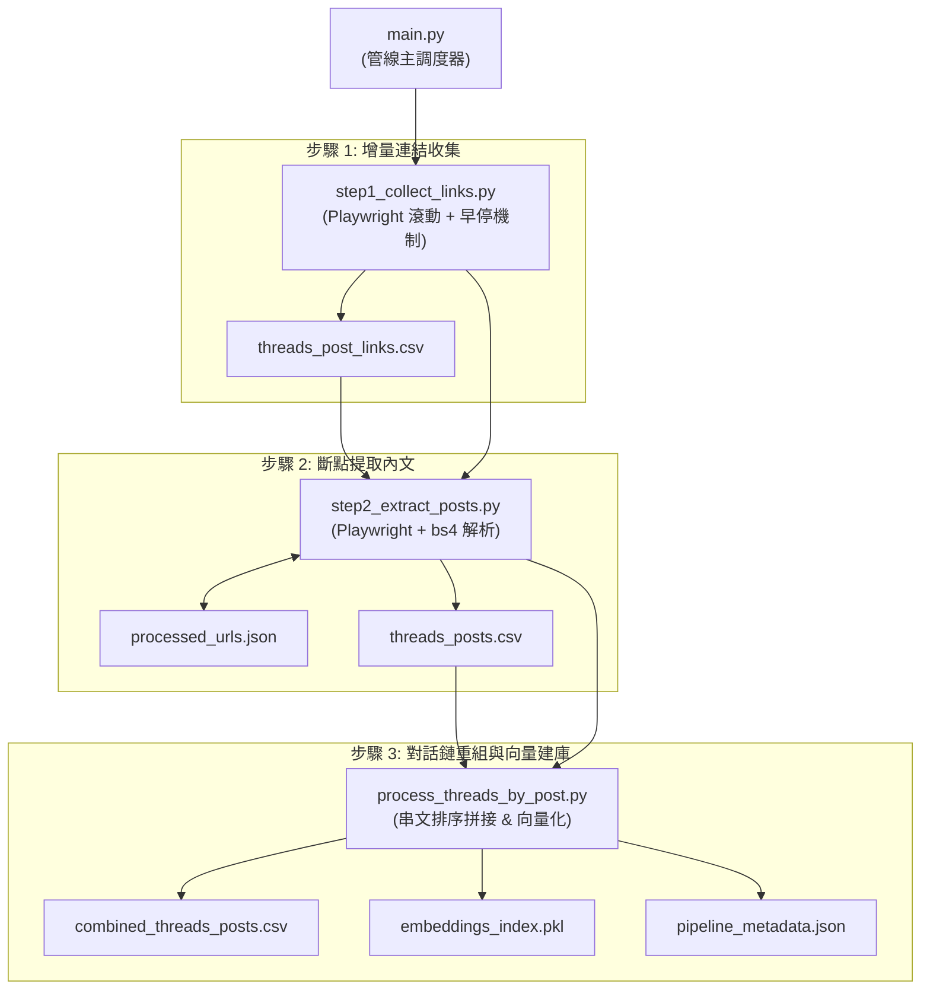

# Threads 財經與職涯問答助理 v2.0 (RAG Web App)

本專案是一個基於檢索增強生成 (RAG, Retrieval-Augmented Generation) 技術的問答助理系統。知識庫資料取自 Threads 帳號 [@make_investment_easy](https://www.threads.net/@make_investment_easy)（前投資銀行交易員）所發布的財經分析（如資產估值、日圓套利、裂解價差）與職涯決策觀點。

系統結合自動化資料採集管線、兩階段語意檢索架構與 Streamlit 網頁介面，將碎片化的社群串文重組為結構化對話鏈，提供具備原文引用來源的問答功能。

---

## 系統核心機制

1. **自動化增量資料管線**：
   - **增量收集與早停**：`step1_collect_links.py` 透過比對現有網址清單，當連續發現 4 篇已知貼文時自動觸發早停，減少重複爬取。
   - **斷點續爬**：`step2_extract_posts.py` 透過 `processed_urls.json` 記錄已處理貼文，支援中斷後接續執行，並逐篇寫入 `threads_posts.csv`。
   - **管線主程式**：`main.py` 依序調度連結收集、內文提取、對話鏈重組與向量建庫。
2. **兩階段語意檢索**：
   - **第一階段（語意召回）**：使用 `paraphrase-multilingual-MiniLM-L12-v2` 計算使用者問題與貼文向量的餘弦相似度，篩選出 Top-10 候選貼文。
   - **第二階段（重排序精篩）**：使用 `cross-encoder/ms-marco-MiniLM-L-6-v2` 對提問與候選貼文進行交叉比對評分，選出最相關的 Top-3 貼文送入 LLM。
3. **防護與生成控制**：
   - **API 頻率限制**：實作每分鐘請求數 (RPM ≤ 10) 與每日請求數 (RPD ≤ 200) 的限制機制。
   - **上下文長度截斷**：傳送給 Gemini 前動態限制總字元數在 3000 字以內，維持回應速度。
   - **提示詞約束**：嚴格要求模型僅依據檢索到的貼文內容回答，無相關資料時如實告知。
4. **網頁介面功能 (Streamlit)**：
   - 對話歷程紀錄與 Markdown 渲染。
   - 提供「查看參考來源與相關性評分」折疊區塊，顯示引用的貼文編號、內容與重排序分數。
   - 側邊欄支援調整生成溫度 (Temperature) 與重排序選取篇數 (Top-K Rerank)。

---

## 系統架構流程圖

### 1. 資料取得與建庫管線 (Data Pipeline)



### 2. RAG 檢索與回答生成流程 (RAG Retrieval Flow)

```mermaid
graph TD
    U[使用者輸入提問] --> Cleaner[TextCleaner<br>文本清洗與標準化]
    Cleaner --> BiEncoder["VectorIndexer<br>第一階段: 向量召回 (Top-10)"]
    PKL[(embeddings_index.pkl)] -.-> BiEncoder
    BiEncoder --> CrossEncoder["CrossEncoderReranker<br>第二階段: 交叉比對重排序 (Top-3)"]
    CrossEncoder --> Limiter["RateLimiter<br>RPM ≤ 10 / RPD ≤ 200 限制"]
    Limiter --> Truncator["上下文長度控制<br>3000 字元截斷"]
    Truncator --> Gemini["GeminiGenerator<br>LLM 結合上下文生成繁中回答"]
    Gemini --> UI["Streamlit UI<br>呈現回答與可展開的參考來源"]
