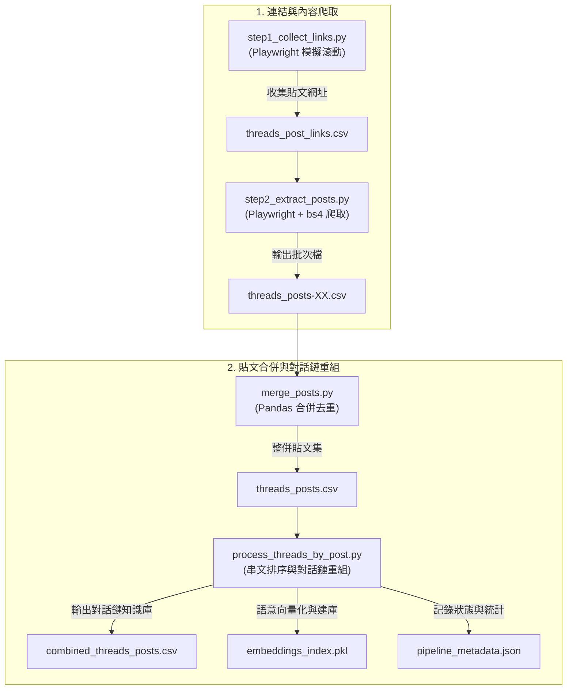
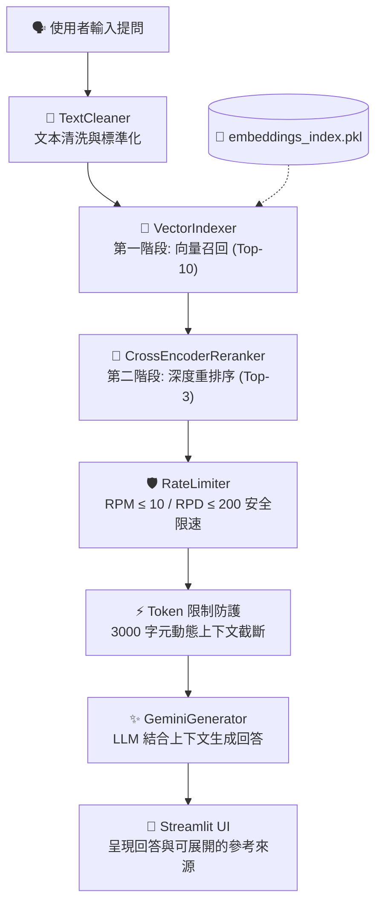

# 📊 Threads 財經與職涯智慧問答助理 v2.0 (RAG Web App)

本專案是一個基於 **RAG (Retrieval-Augmented Generation，檢索增強生成)** 技術的智慧問答助理網頁應用程式。專案知識庫來源為 Threads 平台上某前投資銀行交易員所分享的高價值財經觀點（如資產配置、日圓套利、大宗商品交易）與金融業職涯晉升思維。

透過**兩階段高精準檢索架報**與 **Streamlit 互動介面**，系統能重組被切碎的 Threads 串文，提供使用者有理有據、防幻覺（不胡說八道）且低延遲的專業對話服務。

---

## 🚀 專案核心特點

1. **雙階段高精準檢索 (Two-Stage Retrieval)**：
   * **第一階段（語意召回）**：使用多語言 Sentence-Transformer 模型 (`paraphrase-multilingual-MiniLM-L12-v2`) 對使用者提問進行向量初篩，快速召回相似度最高的 **Top-10** 候選貼文。
   * **第二階段（精篩重排序）**：使用 Cross-Encoder 模型 (`cross-encoder/ms-marco-MiniLM-L-6-v2`) 對提問與候選貼文進行一對一深度交互注意力評分，精選出最相關的 **Top-3** 貼文送至 LLM。
2. **生產級安全防護機制**：
   * **API 限速保護**：設有 RPM ≤ 10（每分鐘請求數）及 RPD ≤ 200（每日請求數）的慢速防護機制，防止 API Key 被惡意刷爆。
   * **Context 動態截斷**：在傳送給 Gemini 之前，動態限制上下文長度在 3000 字（約 2000 tokens）以內，兼顧生成品質與低延遲（控制在 5–8 秒內）。
3. **高品質網頁 UI (Streamlit)**：
   * 仿照 ChatGPT 的聊天氣泡對話框。
   * **參考來源展開面板**：提供「查看參考來源與相關性評分」的折疊選單，透明揭露 AI 所引用的原始貼文內容與 Rerank 分數，徹底消除幻覺疑慮。
   * 側邊欄參數即時調整：支援調整生成溫度 (Temperature) 與 Top-K Rerank 數量。

---

## 🗺️ 系統架構與流程圖

本專案的核心由「資料取得管線」與「RAG 雙階段檢索問答」兩大部分組成，流程設計如下：

### 1. 資料取得與建庫管線 (Data Pipeline)
負責將 Threads 社群平台散落、切碎的短貼文與長串文，進行自動化爬取、重組去重，最終建立為 AI 語意向量資料庫：



### 2. RAG 雙階段檢索與回答生成 (RAG Retrieval & Generation Flow)
使用者在前端輸入提問後，系統執行高精準度、低延遲的語意檢索與防護機制，最後由 Gemini 生成回答：



---

## 📁 檔案結構與角色說明

| 檔案 | 類型 | 角色說明 | 核心技術 / 套件 |
|---|---|---|---|
| **`app.py`** | Python | 網頁前端與互動控制主程式，處理 Streamlit UI 渲染及對話狀態維護 | `streamlit` |
| **`rag_engine.py`** | Python | RAG 核心運算引擎（含 `TextCleaner`、`VectorIndexer`、`Reranker`、`RateLimiter`、`GeminiGenerator`） | `sentence_transformers`, `google-generativeai`, `scikit-learn` |
| **`step1_collect_links.py`** | Python | 資料管線步驟 1：模擬登入自動滾動目標主頁，收集貼文網址 | `playwright` |
| **`step2_extract_posts.py`** | Python | 資料管線步驟 2：爬取各網址的主貼文與原作者後續串文，輸出批次 CSV | `playwright`, `beautifulsoup4` |
| **`merge_posts.py`** | Python | 資料管線步驟 3：整併所有批次 CSV，並進行內容去重 | `pandas` |
| **`process_threads_by_post.py`**| Python | 資料管線步驟 4：按貼文與串順序排序重組對話鏈，執行向量建庫 | `pandas`, `pickle` |
| **`combined_threads_posts.csv`**| 資料檔 | RAG 對話檢索最終使用的知識庫主資料（已重組 738 篇對話鏈） | — |
| **`embeddings_index.pkl`** | 資料檔 | 序列化儲存的文字語意向量索引檔（約 1.81 MB，已優化排除模型權重）| — |
| **`pipeline_metadata.json`** | 配置檔 | 記錄目前資料庫的更新時間、總貼文數等統計中繼數據 | — |
| **`requirements.txt`** | 配置檔 | Streamlit 網頁應用程式部署與本機執行的 Python 套件清單 | — |
| **`NLP_主題分群.ipynb`** | Notebook| 非監督分群實驗，包含 KMeans（K=5）與 BERTopic 主題提取分析 | `bertopic`, `sklearn` |
| **`rag_assistant.ipynb`** | Notebook| RAG 檢索與回答生成的本地端 v1.0 實驗與效果驗證 | — |

---

## ⚙️ 環境建置與前置作業

本專案支援 **「1. 執行 RAG 問答網頁」** 以及 **「2. 執行資料爬蟲更新管線」**，請依據您的需求進行環境配置：

### 1. 通用前置步驟
請確保您的系統已安裝 **Python 3.8 ~ 3.11**。

在專案根目錄下，開啟終端機並安裝核心依賴套件：
```bash
pip install -r requirements.txt
```

### 2. 設定 API 金鑰 (GOOGLE_API_KEY)
本專案的 LLM 生成階段使用 Google Gemini API，您需要設定 API Key：
*   **方法 A (推薦)**：在專案根目錄下建立 `.env` 檔案，填入以下內容：
    ```env
    GOOGLE_API_KEY=您的_Gemini_API_Key
    ```
*   **方法 B**：直接在 Streamlit 網頁側邊欄的 "API 配置" 輸入框中以密碼格式填入您的 API Key。

---

## 🕸️ 爬蟲與資料更新管線前置作業 (選用)

如果您需要重新爬取作者的 Threads 貼文並更新知識庫向量，需要進行以下額外配置：

### 1. 安裝爬蟲相依套件
```bash
pip install playwright beautifulsoup4
playwright install chromium
```

### 2. 匯入登入憑證 (`cookies.json`)
Threads 平台有嚴格的訪客瀏覽限制，為了能向下滾動爬取完整的歷史貼文，需要提供模擬登入憑證：
1. 在瀏覽器登入您的 Threads 帳號。
2. 使用瀏覽器擴充功能（如 *EditThisCookie* 或 *Get cookies.txt LOCALLY*）將 cookies 匯出為 JSON 格式。
3. 將其儲存至專案根目錄下的 **`cookies.json`**。
   *(⚠️ **注意：請勿將 cookies.json 與寫有 API Key 的 .env 檔案上傳至任何公開的 GitHub 儲存庫，以免個人隱私與帳號外洩。**)*

---

## 🏃 執行指南

### 運作 RAG 問答網頁
完成通用前置步驟後，執行以下指令啟動 Streamlit 服務：
```bash
streamlit run app.py
```
啟動後，瀏覽器會自動開啟網頁界面（預設為 `http://localhost:8501`），即可開始與助理聊天。

### 重建資料庫與向量索引 (資料管線流程)
若要重新爬取並重建知識庫，請依序在終端機中執行以下腳本：

```bash
# 步驟 1：收集作者所有的貼文網址 (產出 threads_post_links.csv)
python step1_collect_links.py

# 步驟 2：爬取貼文內容與後續串文 (產出 threads_posts-XX.csv 批次檔)
python step2_extract_posts.py

# 步驟 3：合併批次檔並進行初步內容去重 (產出 threads_posts.csv)
python merge_posts.py

# 步驟 4：進行對話鏈排序拼接、語意清洗，並重新計算 Embedding 序列化建庫
python process_threads_by_post.py
```
執行完步驟 4 後，`embeddings_index.pkl` 與 `pipeline_metadata.json` 將會自動更新，網頁問答助理再次啟動時即會載入最新的知識庫。
