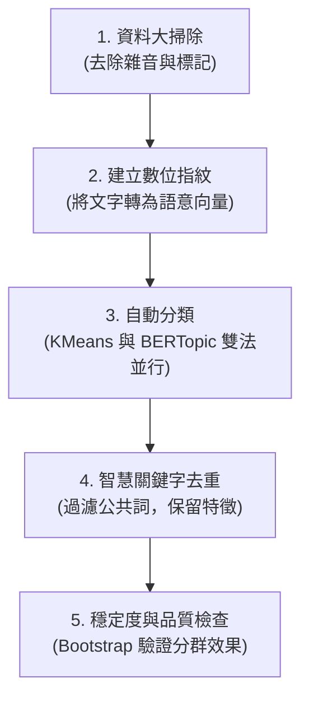

# 📊 NLP 主題分群分析報告（v7.2 — 純非監督版）

這份分析報告針對 [[NLP_主題分群.ipynb](file:///c:/Users/Kevin/Desktop/NEWFILE/NLP/FinalProject/NLP_%E4%B8%BB%E9%A1%8C%E5%88%86%E7%BE%A4.ipynb)] 程式檔進行了解析。此程式的主要任務是：**「用人工智慧（AI）自動閱讀並分類 715 篇社群貼文，並找出核心主題」**，全程不需要人工手動分類。

---

## 📌 一、核心運作流程（通俗版解說）

想像這是一個**「超級圖書管理員」**整理雜亂書堆的過程：

### 1. 資料大掃除（Data Cleaning）
*   **做什麼**：清除貼文中的雜訊。例如移除網頁換行符號、多餘空格，以及作者寫長文時留下的 `(續)` 或 `(续)` 等標記。
*   **比喻**：就像在整理檔案前，先拍掉紙張上的灰塵、撕掉無用的便條貼。

### 2. 建立數位指紋（Text Embedding）
*   **做什麼**：電腦看不懂字，但可以幫每篇文章算出一組「數字指紋」。程式使用支援中文的 AI 模型，把每篇貼文轉化為一串代表「語意」的數值。
*   **比喻**：即使貼文 A 說「想存錢退休」，貼文 B 說「老年生活要有足夠養老金」，AI 邊能認出這兩篇的指紋非常接近，因為它們在聊同一件事。

### 3. 物以類聚：自動分類（Clustering）
程式使用了兩種不同的「分類大師」進行分群，並互相對照：
*   **方法一（KMeans）**：像個強硬的分類法，規定把所有文章分到 5 個大抽屜裡。
*   **方法二（BERTopic）**：像個精細的分類法，自動偵測出 12 個主題，並把不屬於任何主題的邊緣文章當成「離群值」排除，不勉強歸類。

### 4. 智慧去重與提煉關鍵字（Keyword Refinement）
*   **做什麼**：如果直接叫電腦列出各組關鍵字，每組都會充斥著「市場」、「投資」、「人生」等高頻卻無意義的詞。程式會自動過濾掉出現在兩個以上主題的「公共詞」，只保留該主題**最獨特、最顯著**的關鍵字。
*   **比喻**：分類時，如果把「紙張」當作每堆書的特徵，就沒有意義了。我們要抓出的是「微積分」、「食譜」這種能展現主題的專屬詞彙。

### 5. 穩定度與品質檢查（Validation）
*   **做什麼**：程式會像抽樣調查一樣，反覆打亂貼文、隨機抽樣並重新分類 20 次，計算前後分類的一致程度。
*   **比喻**：做實驗時要多做幾次，確保每次的結果都差不多，證明這個分類結果是「穩定的規律」，而不是電腦剛好運氣好猜中的。

---

## 📊 二、分類產出的主題一覽表

AI 自動將貼文分類為 12 個主要話題（排除了離群值貼文）：

| 主題 ID (數量) | 電腦提取之核心關鍵字 | 實際在聊什麼？（代表貼文大意） |
| :--- | :--- | :--- |
| **主題 0** *(145篇)* | 估值 / 股票 / 債券 / 邏輯 | **金融估值與資產配置**：討論如何決定資產的估值、利率對股票債券的影響，以及如何避免「價值陷阱」（買到表面便宜但實際上是坑的資產）。 |
| **主題 1** *(41篇)* | 朋友 / 價值 / 妥協 / 人生 | **職涯規劃與人生空窗期**：探討裸辭做全職投資人的焦慮與風險、如何找到適合自己的事業賽道，以及接受真實自我的轉折。 |
| **主題 2** *(39篇)* | 泰國 / 越南 / 曼谷 / 台灣 / 退休 | **跨國移居與社會觀察**：比較台灣與澳洲的教育環境、去泰國或東南亞外派的觀察，以及探討生在台灣的幸福感。 |
| **主題 3** *(36篇)* | 穩定 / 資金 / 退休 / 風險 | **資金結構與商業模式**：探討巴菲特成功的底層邏輯（保險浮存金帶來的長期低成本資金），以及寵物經濟的投資思考。 |
| **主題 4** *(31篇)* | 日本 / 匯率 / 央行 / 泡沫 / 股市 | **日本經濟歷史對比**：解析日圓升值與 1985 年日本「廣場協議」經濟泡沫，並探討這與現今台灣經濟結構的巨大差異。 |
| **主題 5** *(28篇)* | 小孩 / 教育 / 老師 / 父母 / 別人 | **教育思維與人生哲理**：批判學校的線性訓練（普魯士工具人教育），討論真實商業世界中的隨機性與挫折應對。 |
| **主題 6** *(19篇)* | 美元 / 中國 / 川普 / 關稅 / 國債 | **地緣政治與全球貿易**：探討川普關稅政策對美元信用、美債風險的影響，以及中美經濟熱戰下台灣的選擇。 |
| **主題 7** *(16篇)* | 基金 / 經理 / 策略 / 部位 | **專業機構與量化策略**：揭密避險基金做空操作的運作方式，以及破解一般散戶盲信「低波動、高股息 = 睡後收入」的觀念。 |
| **主題 8** *(16篇)* | 私募 / 技術分析 / 未來 | **產業訊息提取**：探討投行分析師身份轉換為「普通人」的心路歷程，以及在 AI 時代如何提煉有價值的訊息，做深度的情境分析。 |
| **主題 9** *(13篇)* | 油價 / 裂解價差 / 能源 / 供給 | **能源與原物料交易**：揭示散戶交易石油時面臨的資訊滯後問題，並分享在俄烏戰爭期間進行「裂解價差套利」的實務經驗。 |
| **主題 10** *(12篇)* | 健康 / 每天 / 理想 / 工作 / 焦慮 | **身心健康與自己和解**：反思市面上的心靈雞湯，分享高壓投行生活如何透支身體，以及年老時如何避免日復一日的內耗。 |
| **主題 11** *(12篇)* | 自卑 / 能量 / 公司 / 機會 / 社會 | **心理與自我探索**：探討創業尋找合夥人的中西文化差異，以及在投資與人生中，自卑如何長成自大並帶來毀滅性的失敗。 |

---

## 🚀 三、v7.2 版本的優化重點（與舊版差異）

與先前的程式版本相比，目前的 **v7.2** 做了以下重大升級：

*   **完全移除人工標籤（純非監督學習）**：
    舊版本混入了人類預先標記的標籤來評估分類好壞，違背了讓電腦「自主學習」的原則。新版本改為純非監督模式，利用電腦自己計算各群組的詞頻對比（TF-IDF），自動提取能區分群組的詞彙。
*   **雙層關鍵字去重**：
    為了解決各群關鍵字大量重複（如「市場」同時出現在多個主題中）的問題，程式首先使用模型內建的 MMR 演算法去除同一群組內意思太近的詞，再手動排除跨群組重複出現的公共高頻詞，讓每個主題的關鍵字「壁壘分明」。
*   **多指標驗證**：
    評估分類好壞時，不再僅看單一的「輪廓係數（Silhouette）」，而是加入了 Calinski-Harabasz 與 Davies-Bouldin 等多項數學指標進行交叉驗證，使評估結果更具客觀性。
*   **分群穩定性測試（Bootstrap）**：
    新增了隨機重抽樣的穩定度計算。如果每次重抽分類結果都差很多，代表分類不可靠。目前評估結果為「中等穩定」，提示未來可以嘗試微調分類數量（$k$ 值）或更換其他語意模型。
