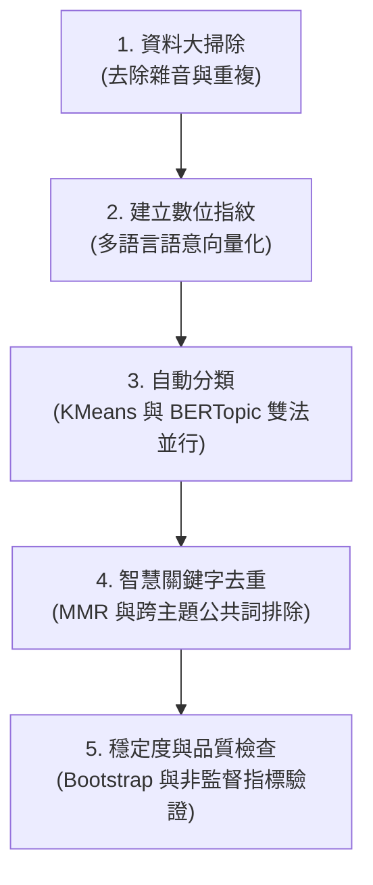

# 📊 NLP 主題分群分析報告（v7.2 — 純非監督版）

這份分析報告針對 [[NLP_主題分群.ipynb](file:///c:/Users/Kevin/Desktop/NEWFILE/NLP/FinalProject/NLP_%E4%B8%BB%E9%A1%8C%E5%88%86%E7%BE%A4.ipynb)] 程式檔進行了解析。此程式的主要任務是：**「用人工智慧（AI）自動閱讀並分類 711 篇社群貼文，並找出核心主題」**，全程不需要人工手動分類。

---

## 📌 一、核心運作流程（通俗版解說）

想像這是一個**「超級圖書管理員」**整理雜亂書堆的過程：

### 1. 資料大掃除與去重（Data Cleaning & De-duplication）
*   **做什麼**：首先透過字首比對排除重複貼文，接著清除貼文中的雜訊，例如移除特定回覆標籤、網頁換行符號、多餘空格，以及作者寫長文時留下的 `(續)` 或 `(续)` 等標記。
*   **比喻**：就像在整理檔案前，先剔除內容重複的影本，並拍掉紙張上的灰塵、撕掉無用的便條貼。

### 2. 建立數位指紋（Text Embedding）
*   **做什麼**：電腦看不懂字，但可以幫每篇文章算出一組「數位指紋」。程式使用支援 50 多種語言的預訓練語意模型 `paraphrase-multilingual-MiniLM-L12-v2`，將每篇貼文轉化為一串代表「語意」的 384 維數值向量。
*   **比喻**：雖然文字寫法不同，但 AI 能認出「想存錢退休」與「老年的養老金規劃」兩篇的指紋非常接近，因為它們在聊同一個概念。

### 3. 物以類聚：自動分類（Clustering）
程式使用了兩種不同的「分類大師」進行分群，並互相對照：
*   **方法一（KMeans）**：硬性分類法，規定把所有文章切分為 $k=5$ 個大群組。
*   **方法二（BERTopic）**：精細分類法，基於密度分群，自動偵測出 11 個主題，並把不屬於任何主題的邊緣文章當成「`-1` 離群值」排除，避免強行歸類。

### 4. 智慧去重與提煉關鍵字（Keyword Refinement）
為了解決傳統關鍵字充斥公共高頻詞（如「市場」、「投資」、「人生」）的問題，本版實施**兩層去重**：
*   **第一層 (模型層)**：使用最大邊際相關性（MMR, `diversity=0.4`），消除單一主題內語意高度相近的贅詞。
*   **第二層 (展示層)**：統計出現在 2 個或以上主題的高頻公共詞並予以排除，改以主題特有詞補齊，使各主題關鍵字壁壘分明。

### 5. 穩定度與品質檢查（Validation）
*   **做什麼**：評估指標不再依賴人工標籤，完全採用 Silhouette、Calinski-Harabasz、Davies-Bouldin 三項非監督內部指標。同時，進行 20 次隨機重抽樣的 Bootstrap 測試，以驗證分群結果的穩定度。

---

## 📊 二、分類產出的主題一覽表

### 1. BERTopic 主題分群結果（共 11 個有效主題，已排除 `-1` 離群值）

經過雙層關鍵字去重後，AI 從 711 篇貼文中提取的核心主題如下：

| 主題 ID (數量) | 電腦提取之特徵關鍵字 | 實際在聊什麼？（代表貼文大意） |
| :--- | :--- | :--- |
| **主題 0** *(181篇)* | 利率 / 股票 / 匯率 | **金融估值與利率股票**：討論資產估值邏輯、WACC、Warrant、利率與匯率對股票債券的傳導，以及信用利差的極端壓力測試。 |
| **主題 1** *(38篇)* | 觀點 / 提問 / 選擇 / 資訊 | **思考表達與賽道邏輯**：探討溝通中的傾聽與留白引導、金融知識的賽道適配性，以及如何批判性地提煉有價值的訊息。 |
| **主題 2** *(34篇)* | 教育 / 未來 / 薪水 / 家庭 / 畢業 | **家庭教育與職涯成長**：從養狗延伸生命教育、反思學校的線性思維與普魯士流水線教育，並探討職場現實中的隨機性。 |
| **主題 3** *(21篇)* | 泰國 / 新加坡 / 國家 / 回台灣 / 人口 | **跨國移居與社會觀察**：比較澳洲、新加坡與台灣的生活與孩子成長環境，討論身在台灣的優勢與套利。 |
| **主題 4** *(16篇)* | 基金 / mstr / 基金 經理 / 歐洲 / 溢價 | **機構部位與槓桿套利**：揭密避險基金經理人的做空操作、高股息基金與低波動的偽風險，以及 MicroStrategy (MSTR) 的 mNAV 溢價。 |
| **主題 5** *(15篇)* | 自卑 / 決策 / 比如 / 環境 | **心理探索與決策分析**：剖析自卑如何長成自大並帶來毀滅性失敗，以及在高隨機性的商業世界中如何打好人生爛牌。 |
| **主題 6** *(15篇)* | 油價 / 裂解 價差 / 供給 / 能源 | **原物料與能源交易**：介紹原油近遠月價差與供給需求框架，並分享在俄烏戰爭期間操作汽油「裂解價差套利」的實務。 |
| **主題 7** *(13篇)* | 飲料 / 星巴克 / 朋友 / 咖啡 | **商業觀察與人際本事**：透過與台中創業者、年輕營業員等案例，討論 coffee chat、好相處如何轉化為真實的商業資本。 |
| **主題 8** *(13篇)* | 分析 / 技術 分析 / 公司 / 情境 分析 | **技術分析辨析與身份轉換**：探討技術分析背後的行為金融學限制，以及作者卸下投行分析師身份轉換為 nobody 的真實自我探索。 |
| **主題 9** *(12篇)* | 退休 / 收入 / 資金 / 年薪 / 保險 | **理財翻身與退休配置**：分析月薪30K新鮮人如何靠工作所得本金翻身（反對窮人投機），以及巴菲特保險浮存金商業模式。 |
| **主題 10** *(10篇)* | 美國 / 川普 / 中國 / 政治 | **地緣政治與全球貿易**：探討川普加徵關稅政策對中概股、美元信用與美債風險的影響，以及台積電赴美設廠的 EPS 衝擊。 |
| **離群值 -1** *(271篇)* | 市場 / 邏輯 / 時間 / 風險 | **噪訊與邊緣貼文**：無法被明確歸入以上 11 個主題的碎裂資訊。 |

---

### 2. KMeans 分群結果（固定 $k=5$ 大群組）

透過群內相對 TF-IDF 詞頻統計（已去除跨群公共詞），KMeans 歸納出的 5 大類別特徵為：

*   **群 0 (n=113) - 能源與商品交易**：代表詞為 `汽油 / 柴油 / rrp / 煉廠 / 航煤 / duc`。聚焦大宗商品、能源交易實務與套利邏輯。
*   **群 1 (n=153) - 自我探索與職涯規劃**：代表詞為 `自卑 / 健身 / 30k / 談資 / 師父`。涵蓋心理學探討、月薪30K翻身邏輯與自我啟發。
*   **群 2 (n=195) - 金融估值與量化交易**：代表詞為 `t1 / vol / skew / coinbase / capm`。聚焦於期權波動度偏斜、估值模型、高殖利率與金融學理論。
*   **群 3 (n=66) - 移民教育與人口社會**：代表詞為 `月入 / monash / 生育率 / 補助 / 觀光`。討論跨國移居澳洲（如 Monash 大學生活）、生育率與社會福利。
*   **群 4 (n=184) - 生活哲學與思想留白**：代表詞為 `古龍 / 心流 / 象限 / 白目 / 支點`。涉及個人哲學思考、古龍小說隱喻、心流狀態與日常溝通藝術。

---

## 📈 三、數學指標與驗證結果

本版（v7.2）引入了多項無監督評估指標，對分群進行了全面的數學驗證：

### 1. KMeans 分群內部指標對照表（$k=5$）
*   **輪廓係數 (Silhouette Score)**：`0.0338` (範圍 $[-1, 1]$，越高代表群內越緊密、群間越遠)
*   **CH 指標 (Calinski-Harabasz)**：`25.73` (越高越好，代表群內離散度低、群間離散度高)
*   **DB 指標 (Davies-Bouldin)**：`3.9352` (越低越好，下限為 0)

*註：在 $k=2 \sim 10$ 的交叉驗證實驗中，指標在 $k=2$ 時達到 Silhouette 峰值 (0.0740)，但為保留足夠的語意解析度，本專案選擇了語意最多樣且 CH、DB 均衡的 $k=5$ 作為主要分類設定。*

### 2. 分群穩定度驗證（Bootstrap 穩定性）
*   透過隨機重抽樣 KMeans 進行 20 次重複實驗，計算兩次分類的 Adjusted Rand Index (ARI) 分布：
    *   **ARI 均值**：`0.5264` (標準差: `0.0866`)
    *   **ARI 範圍**：`[0.3974, 0.7345]`
    *   **結論**：此數據顯示分群結構屬於 **「中等穩定」**，提示未來可嘗試微調 $k$ 值或微調 Embedding 特徵。

### 3. KMeans 與 BERTopic 語意一致性
*   排除 BERTopic 離群值 (Topic -1) 後，計算兩種獨立非監督方法在測試集上的對照結果：
    *   **Adjusted Rand Index (ARI)**：`0.7256`
    *   **Normalized Mutual Information (NMI)**：`0.9157`
    *   **結論**：ARI 與 NMI 高度接近 1，表示 KMeans 與 BERTopic 雖然模型原理不同，但對資料庫的底層語意理解達到了高度的一致性。

---

## 🚀 四、v7.2 版本的優化重點（與舊版差異）

相較於 v6.x 系列，目前的 **v7.2** 實現了以下重大優化：

1.  **完全移除人為標籤流程（實踐純非監督學習）**：
    *   舊版本違背非監督學習原則，混入了人為標記進行評估。新版本將其完全移除，改以 **群內相對 TF-IDF** 自動提取各群特徵詞，並加入 **Bootstrap ARI** 分群穩定性評估。
2.  **關鍵字重複問題的雙層去重策略**：
    *   為解決多個主題共享「市場」、「投資」等高頻無特徵詞的問題，先利用 MMR 進行主題內語意多樣化，再於展示層統計並排除跨主題公共詞（出現在 $\ge 2$ 個主題的詞彙），使顯示的特徵詞區別度大幅提升。
3.  **相容性與記憶體警告機制**：
    *   針對舊版 `n_init='auto'` 與 `token_pattern=None` 在不同 scikit-learn 版本中的報錯進行了防禦性修正（鎖定 `n_init=10` 並加入相容性檢查），並對大數據集（>2萬筆）加入 `calculate_probabilities=False` 的記憶體防護警告。
