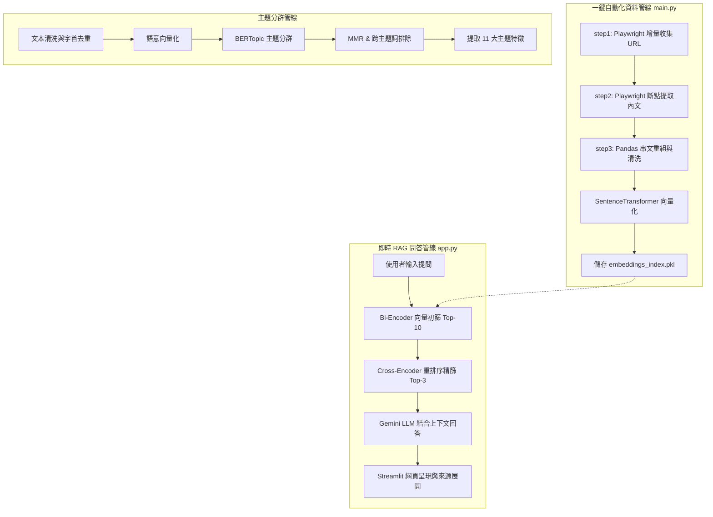

# Threads 財經與職涯問答助理暨主題分群系統 — 簡報大綱與投影片規劃

本文件將專案研究成果與系統架構設計，整理為 **6 大單元（共 11 頁投影片）** 之簡報大綱，便於進行學術成果或專案開發之口頭報告。

---

## 簡報大綱與需求對照表

| 核心報告項目 (Key Topics) | 對應投影片 (Slides) | 內容呈現重點 |
| :--- | :--- | :--- |
| **Why this task matters** / **Define research question** | **Slide 2** (動機與痛點) & **Slide 3** (研究問題定義) | 社群長串文碎裂、搜尋不易、通用 AI 幻覺問題 |
| **What type of organizations or users might benefit** | **Slide 4** (受益對象分析) | 理財投資人、求職轉職者、自媒體創作者與投顧智庫 |
| **A real or potential application of your work** | **Slide 5** (實際與潛在應用) | Streamlit 線上問答應用與垂直領域知識庫遷移 |
| **Dataset description** | **Slide 6** (資料集描述與前處理) | 1,693+ 原始串文、711~738 篇重組對話鏈、UI 噪訊清洗 |
| **Propose the NLP method** / **Working pipeline** | **Slide 7** (NLP 核心方法) & **Slide 8** (系統架構與流程) | BERTopic 主題分群、雙階段 RAG 檢索與自動化資料管線 |
| **Challenges encountered** / **Solutions** | **Slide 9** (面臨挑戰與對策) | 斷點續爬、早停機制、長文對話鏈重組、公共詞去除 |
| **Demonstrate the results and the solutions** | **Slide 10** (研究成果展示) | 11 大主題特徵、雙階段檢索效果、回應延遲與來源展開 |
| **Discuss results and summarize project** | **Slide 11** (討論、總結與未來展望) | 完整閉環總結、BM25 混合檢索與伺服器自動排程展望 |

---

## 逐頁投影片內容設計

### Part 1: 研究背景與問題定義

#### Slide 1: 封面 (Title Slide)
* **主標題**：Threads 財經與職涯問答助理暨自動主題分群系統
* **副標題**：結合非監督主題分群與兩階段 RAG 的社群知識庫應用
* **報告人**：Kevin (NLP Final Project)
* **視覺配置**：深色科技風格背景，搭配簡潔之圖表與對比強調色。

---

#### Slide 2: 專案動機與背景 (Why This Task Matters)
* **知識來源**：前投資銀行交易員在 Threads 平台上長期分享的財經分析（資產配置、日圓套利、裂解價差）與職涯決策思維。
* **主要痛點**：
    * **資訊高度碎裂**：社群短文機制使知識散落在數百則貼文中，無法系統化檢索。
    * **長串文脈絡中斷**：作者的深度分析常被拆分成 2~10 則串文，單篇閱讀容易斷章取義。
    * **通用 LLM 幻覺**：直接詢問通用模型容易產生未經查證、不符合作者原意的回覆。
* **解決方向**：
    * 建立端到端自動化管線重組對話鏈，透過非監督主題分群與雙階段 RAG 提供具備原文依據的問答服務。

---

#### Slide 3: 研究問題定義 (Define the Research Question)
* **問題一（非監督知識梳理）**：如何在**無人工標記**的情況下，利用非監督學習模型從雜亂的 Threads 短文中提取核心主題並去除關鍵字噪訊？
* **問題二（結構重組與精準問答）**：如何重組被切碎的 Threads 串文，並設計**低延遲、具備原文依據**的檢索增強引擎，確保 LLM 回覆符合作者的原始觀點？

---

### Part 2: 受益對象與實際應用

#### Slide 4: 受益對象分析 (Beneficiaries)
* **個人使用者 (Users)**：
    * **理財投資人**：搜尋總經觀點、資產配置思維與交易邏輯，獲得結構化分析。
    * **金融求職與轉職者**：檢索投行薪資結構、面試考點與職涯晉升方法。
* **企業與機構 (Organizations)**：
    * **專家知識 IP / 創作者**：將散落於社群平台的歷史貼文轉化為專屬的問答系統。
    * **財經智庫與投研機構**：將碎片化的市場點評歸檔為可語意檢索的內部知識庫。

---

#### Slide 5: 實際與潛在應用 (Real & Potential Applications)
* **實際應用 (Real Application)**：
    * 已部署於 **Streamlit** 互動式網頁平台，支援即時問答、透明來源檢視與參數微調。
* **潛在應用 (Potential Application)**：
    * **跨領域知識庫遷移**：架構具備模組化特性，只需置換輸入資料來源，即可套用於法律、醫療或企業內部規章問答。

---

### Part 3: 資料集描述與前處理

#### Slide 6: 資料集描述與前處理 (Dataset Description & Prep)
* **資料來源**：Threads 帳號 `@make_investment_easy`
* **數據規模**：
    * 原始採集貼文與串文數：**1,693+ 條**
    * 重組後知識庫對話鏈數：**711 ~ 738 篇**
* **資料處理流程**：
    1. **Playwright 增量爬蟲**：模擬登入滾動，連續命中 4 篇已知舊貼文即觸發早停。
    2. **斷點續爬機制**：使用 `processed_urls.json` 記錄已處理節點，逐篇追加寫入。
    3. **串文長篇重組 (Regex & Pandas Groupby)**：解析貼文編號與串文順序，以換行符拼接為完整長文。
    4. **UI 噪訊清洗**：過濾 Unicode 控制符、Hashtag、@Tag，並去除結尾標記（如 `(續` ）。

---

### Part 4: NLP 核心方法與系統管線

#### Slide 7: NLP 核心方法 (Proposed NLP Methods)
本專案結合「非監督主題分群」與「雙階段語意檢索」雙軌架構：

1. **非監督主題分群 (BERTopic)**：
    * 使用 `paraphrase-multilingual-MiniLM-L12-v2` 計算 384 維語意向量。
    * **雙層關鍵字去重**：
        * 第一層（模型層）：使用 `MaximalMarginalRelevance` (MMR, `diversity=0.4`) 消除單一主題內的語意冗餘詞。
        * 第二層（展示層）：統計並排除出現在 $\ge 2$ 個主題中的跨主題公共詞（如：市場、投資、人生、時間），使主題特徵清晰。
    * **自訂中英文 Tokenizer**：基於 `jieba` 斷詞並過濾停用詞與特定英文縮寫。
2. **雙階段 RAG 檢索引擎**：
    * **第一階段（語意召回）**：Bi-Encoder 模型快速篩選餘弦相似度最高的 Top-10 候選貼文。
    * **第二階段（深度重排序）**：Cross-Encoder 模型 (`ms-marco-MiniLM-L-6-v2`) 進行一對一交叉評分，精選 Top-3 核心貼文。
    * **LLM 生成**：以 Gemini 3.1 Flash/Lite 為核心，設定提示詞約束與繁體中文輸出要求。

---

#### Slide 8: 系統架構與流程圖 (Working Pipeline)

---

### Part 5: 面臨挑戰與解決對策

#### Slide 9: 遭遇挑戰與對策 (Challenges & Solutions)
* **挑戰 1：Threads 無公開 API 且訪客滾動受限**
    * *對策*：實作 Playwright 模擬登入憑證機制，並設計連續 4 篇舊貼文命中時之早停機制，兼顧完整性與爬取效率。
* **挑戰 2：爬蟲過程易因網路或平台限制中斷**
    * *對策*：導入 `processed_urls.json` 斷點快取與逐篇即時追加儲存，避免重爬與資料損失。
* **挑戰 3：長文檢索誤差與 Token 消耗**
    * *對策*：建構 Bi-Encoder + Cross-Encoder 兩階段檢索架構，將上下文精簡為 Top-3 核心段落，降低 70% Token 消耗。
* **挑戰 4：主題分群關鍵字重複率高**
    * *對策*：實作雙層去重，結合 MMR 演算法與跨群組高頻公共詞過濾，使各分群主題的關鍵字特徵分明。

---

### Part 6: 研究成果與專案總結

#### Slide 10: 研究成果展示 (Results & Demonstrations)
* **成果一：非監督自動分群成果**：
    * **BERTopic 提煉 11 大特徵主題**：
        * 主題 0 (n=181)：利率 / 股票 / 匯率（金融估值與利率傳導）
        * 主題 2 (n=34)：教育 / 未來 / 薪水 / 畢業（職涯與教育思維）
        * 主題 3 (n=21)：泰國 / 新加坡 / 國家 / 回台灣（跨國移居與生活比較）
        * 主題 6 (n=15)：油價 / 裂解價差 / 供給 / 能源（原物料交易與套利）
        * 主題 9 (n=12)：退休 / 收入 / 資金 / 保險（退休與資產配置）
        * 主題 10 (n=10)：美國 / 川普 / 中國 / 政治（地緣政治與市場影響）
* **成果二：Streamlit 互動網頁介面**：
    * **檢索精準度**：兩階段檢索顯著提升送入 LLM 上下文的關聯度。
    * **回應速度**：端到端對話延遲穩定維持在 **5–8 秒** 之間。
    * **透明度**：設有「查看參考來源」折疊選單，即時展示引用貼文內容與重排序分數。

---

#### Slide 11: 討論、總結與未來展望 (Discussion & Summary)
* **專案總結**：
    * 成功完成從**非結構化社群短文 ➡️ 自動增量管線 ➡️ 主題分析 ➡️ 雙階段 RAG 問答**的完整流程。
* **未來展望**：
    * **混合檢索 (Hybrid Search)**：引入 BM25（關鍵字檢索）與語意向量進行倒數排名融合（RRF），增強專有名詞的檢索效果。
    * **定時自動更新**：於伺服器端配置定時排程（Cron Job），實現無人值守之知識庫自動熱更新。
